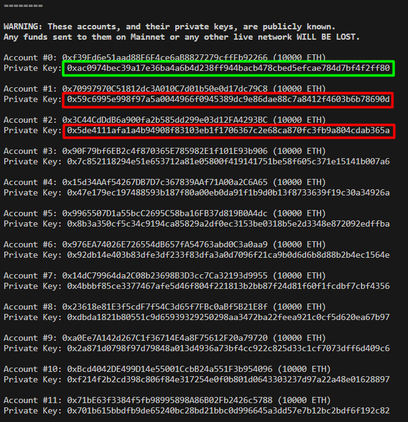
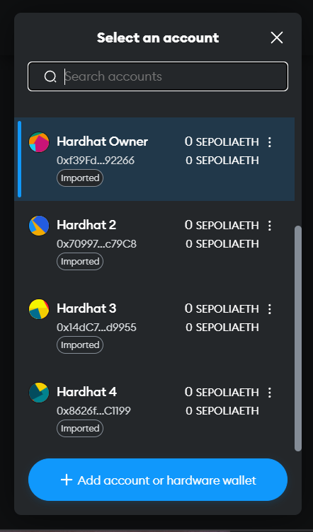
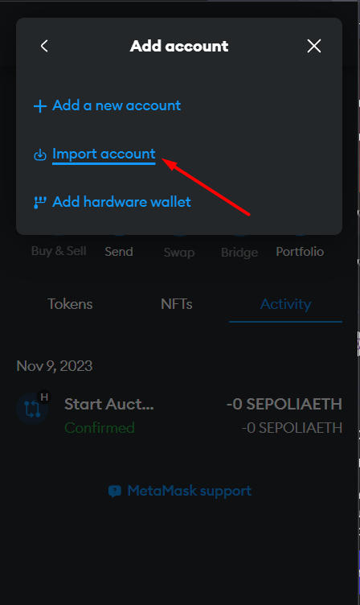
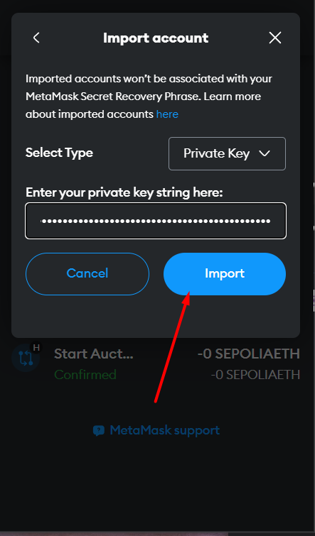
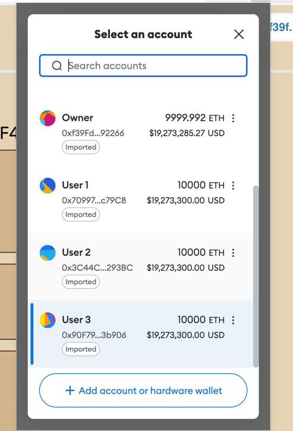
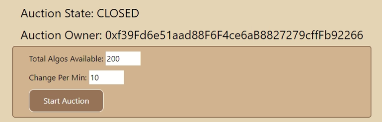

# CZ4153_DutchAuction

Blockchain Project to build a DutchAuction

## PROJECT MEMBERS

- Sankar Samiksha
- Poon Yan Xin Melise

## PROJECT REQUIREMENTS

**Feature Requirement** <br>
Dutch Auction smart contracts should:

- Firstly, define and implement your new token using the ERC20 standard
- Implement Dutch auction logic in another contract(s)
- Only elapse for 20 minutes, either all tokens get sold out at clearing price no lower than the reserved price, or only part of total token supply get sold with the remaining tokens burned by the auction contract
- Be able to distribute the token minted to legitimate bidders at the end of the auction
- (bonus) add tests to demonstrate the auction contract is resistant to reentry attack.
- What is reentry attack,
- hands-on practice on reentry.

<br>

**Tricky Points to Ponder**

- How to enforce auction duration/countdown clock in blockchain?
- How to link/wrap your token contract with your auction contract?
- How to "burn" the unsold tokens?
- How to enforce successful bidder to pay Ether for the new token, (I.e., they can’t cancel the bid) and how to
  refund bids that are invalid?

## CLONING THE REPOSITORY AND INSTALLING PACKAGES

```
git clone https://github.com/S-Samiksha/CZ4153_DutchAuction/tree/main
cd BackEnd_Contract
yarn
cd ..
cd Client
yarn
```

## CONFIGURATIONS 

### CONSTRUCTOR

**Parameters**:
`_reservePrice`: The minimum price of tokens <br>
`_startPrice` : The starting price of a token <br>

```Solidity
constructor(uint256 _reservePrice, uint256 _startPrice) {
        require(
            _reservePrice < _startPrice,
            "reserve price is higher than current price"
        );
        i_owner = msg.sender;
        reservePrice = _reservePrice;
        currentPrice = int256(_startPrice);
        startPrice = _startPrice;

        s_auctionState = AuctionState.CLOSING;
    }

```

**Configuration File**

1. Navigate to the `helper-hardhat-config.js`
2. Change the parameters according to the reserve price, start price you want 

```javascript
const INITIAL_SUPPLY_INT = 200;
const INITIAL_SUPPLY = (INITIAL_SUPPLY_INT * 10 ** 18).toString();
const RESERVE_PRICE = 10;
const START_PRICE = 50;
const INTERVAL = 30;
const CHANGEPERMIN = 15;
```

## ADDING HARHDAT WALLETS TO METAMASK

**Finding Private Keys of Hardhat Wallets**

1. Run `yarn hardhat node`
2. Copy one of the private keys. The first account is the owner by default. 



**Add Account**

1. Press the button `+ Add account or hardware wallet`



**Import Account**

1. Press the `Import account` button



**Paste Private Key**
1. Paste the private key copied earlier
2. Click `Import`



**Final State**



## DEPLOYING THE CONTRACT & FRONTEND

> If you have BASH: <br>
1. Open one terminal for backend
```
cd BackEnd_Contract
chmod +x run.sh
./run.sh
```
2. Open second terminal for front-end
```
cd Client 
yarn dev
```

> If you do not have BASH: <br>
1. Open the first terminal 
```
cd BackEnd_Contract
yarn hardhat node
```
2. Open a second terminal
```
cd BackEnd_Contract
yarn hardhat run scripts/calculate.js --network localhost
```
3. Open a third terminal for front end
```
cd Client 
yarn dev
```

> Finally
1. Open a browser withe the metamask that has the hardhat wallet accounts 
2. Navigate to `http://localhost:3000`

> To end 
On all running terminals, press `ctr+c` to end. 

## STARTING THE AUCTION

**Parameters**: <br>
`_totalAlgosAvailable`: Total number of tokens to be mint for this round of auction <br>
`_changePerMin`: rate of reduction of ETH cost per token. E.g. 10 wei/min means that the cost of one token will fall by 10 wei per min. <br>

```Solidity
function startAuction(
        uint256 _totalAlgosAvailable,
        uint256 _changePerMin
    ) public onlyOwner AuctionClosed returns (address) {
        s_auctionState = AuctionState.OPEN;
        totalAlgosAvailable = _totalAlgosAvailable;
        changePerMin = _changePerMin;
        startTime = block.timestamp; //Start time of when the contract is deployed
        DAToken = new ERC20Token(totalAlgosAvailable, address(this));
        ERC20ContractAddress = address(DAToken);
        emit startAuctionEvent(
            startTime,
            ERC20ContractAddress,
            totalAlgosAvailable,
            changePerMin
        );
        return ERC20ContractAddress;
    }
```

**Interacting with the Start Button in the UI**

1. Add in the number of Algos/Tokens you want the auction to hold 
2. Add in the rate of reduction you want




## HARDHAT TEST SCRIPTS
To run the test scripts that is used to test the contract, run the following:
```
cd BackEnd_Contract
yarn hardhat test
```

## RE ENTRANCY ATTACK


### References:

https://github.com/lamtlo/Solidity-Dutch-Auction/blob/master/contracts/Auction.sol <br>
https://www.algorand.foundation/algo-auction-overview <br>
https://github.com/reddio-com/NFT-Marketplace <br>
https://github.com/BlockchainCourseNTU/hello-dapp/tree/AY2023-AY2024 <br>
